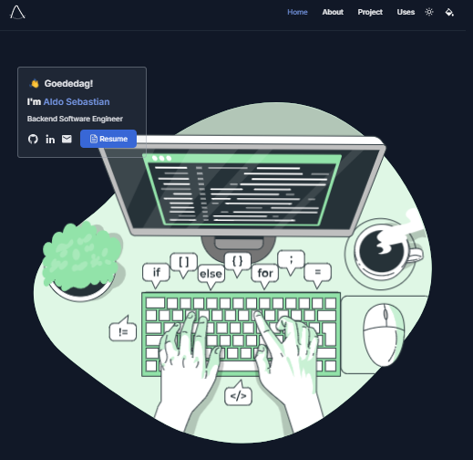

# [aldosebastian.com](https://aldosebastian.com/)


<picture>
  <source media="(prefers-color-scheme: dark)" srcset="./preview-dark.png">
  <source media="(prefers-color-scheme: light)" srcset="./preview.png">
  
</picture>

## Stack
- **Framework**: [Angular](https://angular.dev/)
- **Styling**: [Tailwind CSS](https://tailwindcss.com/)
- **Deployment**: [Github Pages](https://pages.github.com/)

## Running Locally

This application requires Node.js v18.13+.

```bash
npm install -g @angular/cli
git clone https://github.com/makeevolution/aldosebastian.git
cd aldosebastian
npm install
npm start
```
Access the website locally through http://localhost:4200


## Deployment notes
If you are deploying and do not deploy to your own custom domain, set `"baseHref": "/yourreponame/"` entry under deploy in `angular.json`!